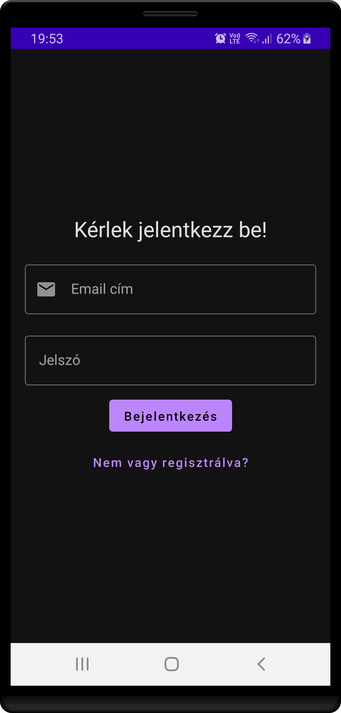
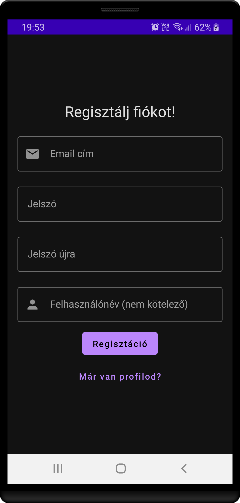
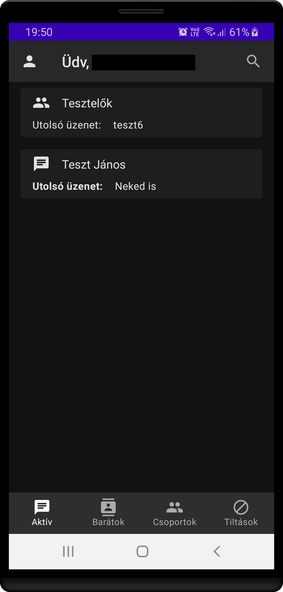
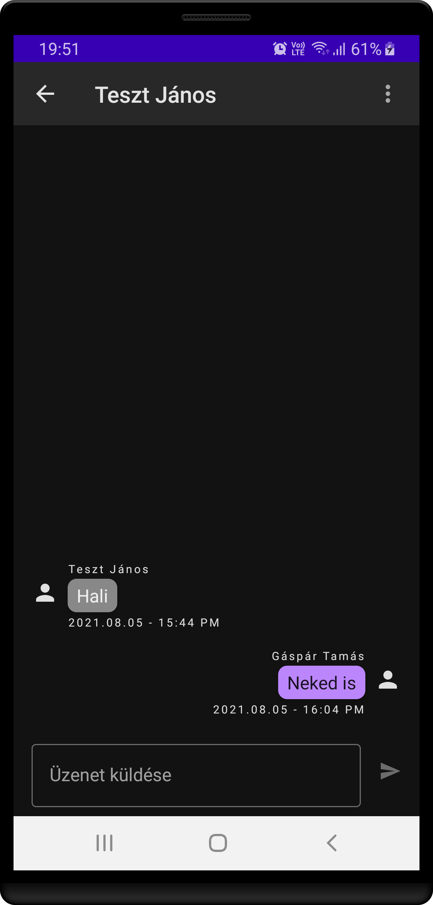
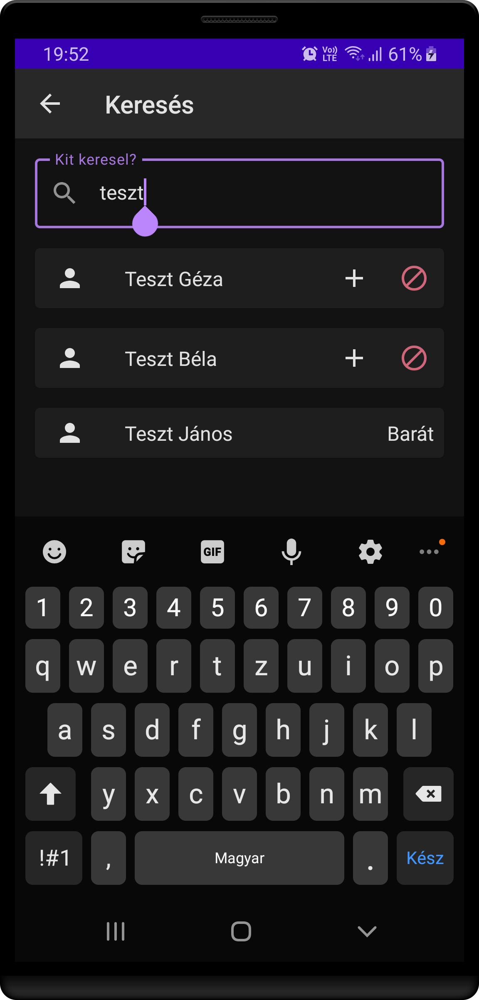
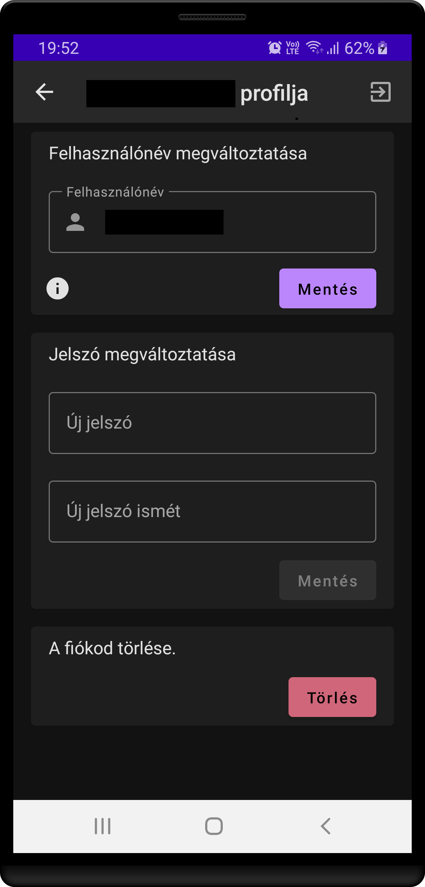

## Compose based chat app

This is my second ever modern Android application, based on Kotlin, View-Model-ViewModel and Jetpack Compose. For my first modern 
app, see [note-composer](https://github.com/Gtomika/note-composer).

Using Firebase as a backend for authentication and storage.

## Screenshots

<table>
  <tr>
    <td> </td>

    <td></td>
   </tr> 
   <tr>
      <td></td>

      <td></td>
  </tr>
   <tr>
      <td></td>

      <td></td>
  </tr>
</table>

## Not intended for Google Play Store

This is a small scale app, intended for family-only use, and not to be deployed on Google Play Store. 
It only has hungarian language support.

## Build

To build this app, you must set up your own Firebase project, then:

 - Copy your *google-services.json* file to the *app* folder.
 - For cloud functions, copy your *admin service account JSON file* to functions folder and rename it *adminServiceAccountKey.json*

Furethermore, your Firebase project must have **Blaze** plan, since this project uses Cloud Functions.